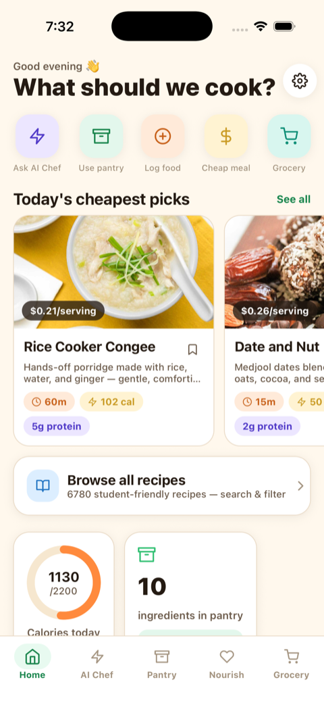
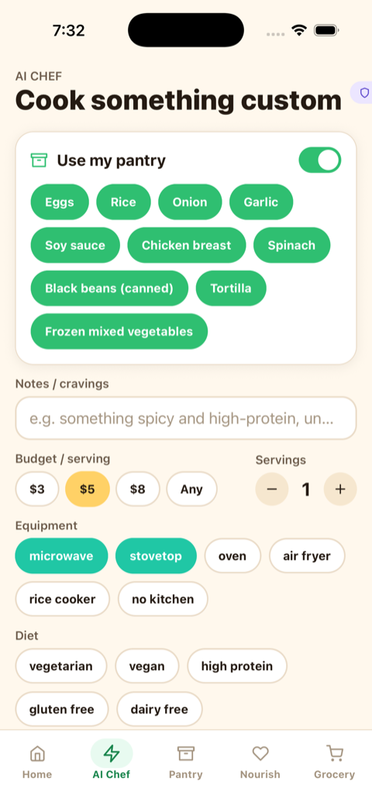
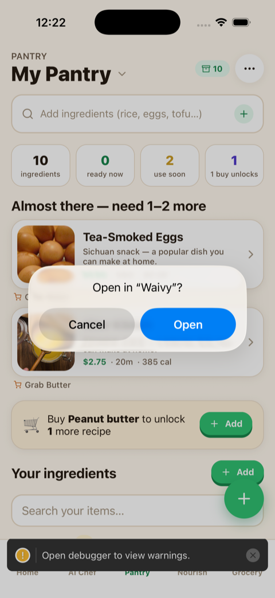
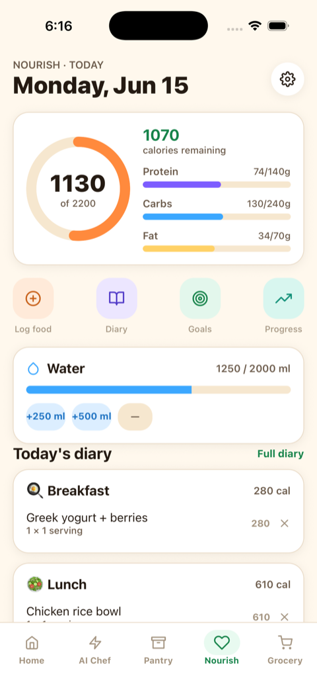
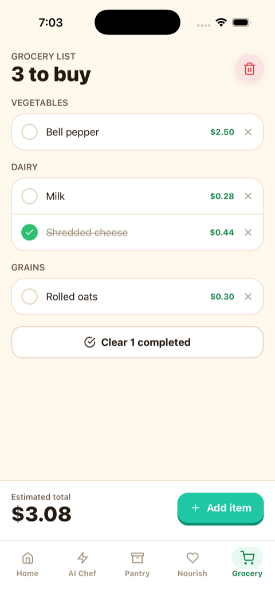
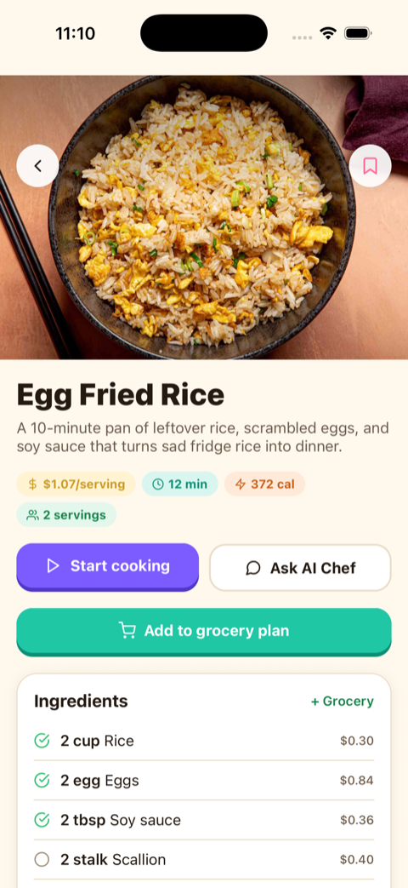
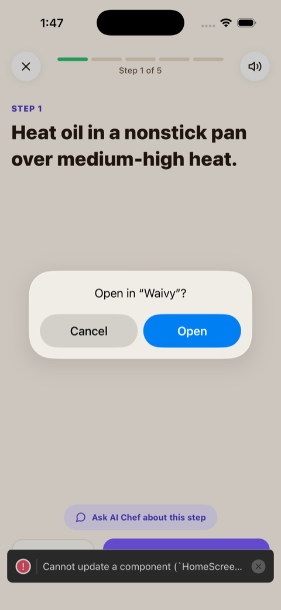
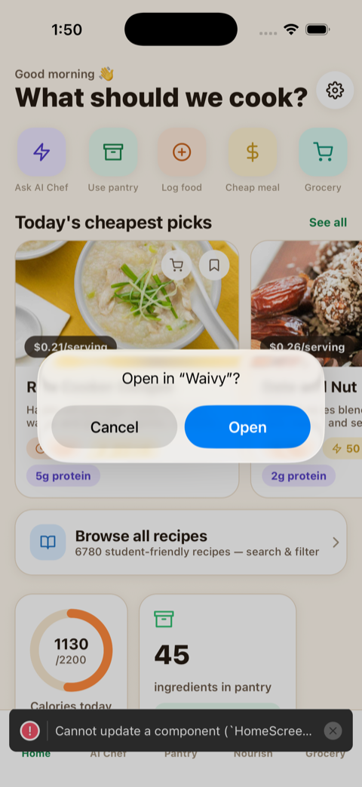

# Waivy

**Live site:** https://justinsuo.github.io/waivy/ · **iPhone app:** [`/mobile`](mobile/) (Expo / React Native)

> 📱 **There is now a native iPhone app** in [`mobile/`](mobile/). It is a mobile-first rebuild (bottom tabs, bottom sheets, gestures, haptics, full-screen guided cooking, camera/voice, local notifications) that **shares this repo's exact business logic** — recipes, the nutrition/pricing/scoring engines, and the AI clients are imported in place from `src/`, not duplicated. A cross-device **sync** layer (`shared/` + the Worker's `/sync` KV endpoints) keeps your pantry, grocery list, saved & custom recipes, and Nourish diary in step between the website and the phone. See [`mobile/README.md`](mobile/README.md).

## 📱 iPhone app screenshots

Auto-captured from the simulator and refreshed on every push (see [`docs/screenshots/`](docs/screenshots/)).

|  |  |  |  |
| :---: | :---: | :---: | :---: |
| <br/>Home | <br/>AI Chef | <br/>Pantry | <br/>Nourish |
| <br/>Grocery | <br/>Recipe detail | <br/>Guided cooking | <br/>Explore |

See all twelve in **[docs/screenshots/](docs/screenshots/)**.

> Waivy (sometimes "Waivy AI") is the AI cooking assistant for students. Previously released as "Student Recipe Finder" — the repo, package name, and live URL were renamed on 2026-06-02. The `srf:` localStorage prefix is kept as-is so existing users don't lose their pantry / saved / grocery list.

A Next.js + TypeScript + Tailwind web app that helps students cook real food with what they already own. It started as a flat recipe database and grew into a small AI cooking platform — pantry tracking, AI Chef recipe generation, AI ingredient understanding, image generation, regional pricing, nutrition math, a guided cooking mode, a global-cuisine explorer, and a manual recipe builder.

The catalog now spans **7,200+ browseable recipes** across cooking methods (incl. **rice cooker**, **blender**, and a deep **oven baking** collection of 250+ bakes — cakes, cookies, breads, pastries, pies & tarts spanning American, French, Italian, Iberian, Eastern-European, Greek/Turkish/Middle-Eastern, and Indian/SE-Asian/East-Asian classics) and meal types (incl. a full **Drinks** category — cocktails, mocktails, smoothies, coffee, tea, and juices), each priced from a 781-ingredient catalog with real per-unit cost and USDA-derived nutrition. Every curated recipe's photo is freely licensed (Wikimedia Commons / CC) and hand-verified to depict the dish.

> 📖 **Browse the whole catalog without opening the app:** [`docs/catalog/`](docs/catalog/README.md) — a visual gallery of all 662 photographed recipes (image + ingredients + steps + real cost/serving), plus [`all-recipes.csv`](docs/catalog/all-recipes.csv) listing every one of the 7,214 browseable recipes with full cost & macro details. Regenerate with `npx tsx scripts/generateCatalogDocs.ts`.

Everything is shipped as a single static export, hosted on GitHub Pages. All OpenAI calls are proxied through a Cloudflare Worker so the API key never reaches the browser. Anthropic Haiku is called directly from the browser for low-latency tasks (vision, voice, quick recipe options, the Pesto chatbot) and is fully optional — the app degrades gracefully when no AI keys are configured.

---

## Table of contents

- [At a glance](#at-a-glance)
- [What's in it](#whats-in-it)
  - [Home `/`](#home-)
  - [AI Chef `/ai-chef`](#ai-chef-ai-chef)
  - [Pantry `/pantry`](#pantry-pantry)
  - [Cheap Recipes `/cheap-recipes`](#cheap-recipes-cheap-recipes)
  - [Explore `/explore`](#explore-explore)
  - [Grocery List `/grocery-list`](#grocery-list-grocery-list)
  - [Saved `/saved`](#saved-saved)
  - [Recipe Studio `/recipe-studio`](#recipe-studio-recipe-studio)
  - [Recipe detail `/recipes/[id]`](#recipe-detail-recipesid)
  - [Custom / AI recipe detail `/recipes/custom`](#custom--ai-recipe-detail-recipescustom)
  - [About `/about`](#about-about)
- [Cross-cutting features](#cross-cutting-features)
  - [Pesto, the floating chat sidekick](#pesto-the-floating-chat-sidekick)
  - [AI Ingredient Intelligence](#ai-ingredient-intelligence)
  - [Cooking method system (air fryer / microwave / no-stove)](#cooking-method-system)
  - [Guided cooking mode](#guided-cooking-mode)
  - [Local pricing engine](#local-pricing-engine)
  - [Nutrition engine](#nutrition-engine)
  - [Smart search](#smart-search)
  - [Recipe scoring & pantry matching](#recipe-scoring--pantry-matching)
  - [Toasts & micro-interactions](#toasts--micro-interactions)
- [AI architecture](#ai-architecture)
  - [Browser-side Anthropic Haiku](#browser-side-anthropic-haiku)
  - [Cloudflare Worker (OpenAI proxy)](#cloudflare-worker-openai-proxy)
  - [External recipe APIs (Explore)](#external-recipe-apis-explore)
- [Design system](#design-system)
- [Data](#data)
- [Domain model](#domain-model)
- [Storage (localStorage) keys](#storage-localstorage-keys)
- [Accessibility & performance](#accessibility--performance)
- [Tech stack](#tech-stack)
- [Repo layout](#repo-layout)
- [Getting started](#getting-started)
- [Environment variables](#environment-variables)
- [Scripts](#scripts)
- [Coding-agent setup (Claude, Cursor, etc.)](#coding-agent-setup-claude-cursor-etc)
- [Deployment](#deployment)
- [Image sources & licensing](#image-sources--licensing)
- [Privacy & data handling](#privacy--data-handling)
- [Known limitations](#known-limitations)
- [Architecture diagram](#architecture-diagram)

---

## At a glance

| | |
| --- | --- |
| **Routes** | 12 (Home, AI Chef, Pantry, Cheap Recipes, Explore, Grocery List, Saved, Recipe Studio, Recipe Studio New, Recipe detail (9,000+ prerendered), Custom recipe, About) |
| **Recipes** | **7,214 browseable** (9,236 total) — curated stovetop/oven, air-fryer, microwave & **rice-cooker** dishes, viral social-media recipes, a global cuisine catalog, a deep **baking** collection (250+ bakes: cakes, cookies, breads, pastries, pies & tarts, international), plus a **Drinks** category (cocktails, mocktails, smoothies, coffee, tea, juices) and a **Blender** category. Each freely-licensed photo is hand-verified to match the dish. |
| **Categories** | meal type (breakfast/lunch/dinner/snack/meal-prep/**drink**) + equipment (microwave/stovetop/oven/rice-cooker/air-fryer/**blender**/no-kitchen) — all filterable |
| **Catalog ingredients** | **781** — with per-unit prices, units, package sizes, shelf life, tags |
| **Per-ingredient nutrition** | USDA-derived per-unit calories / protein / carbs / fat / fiber + confidence |
| **Static pages built** | **9,242** — `npm run build` |
| **Pantry presets** | 8 starter packs (Dorm Starter, Broke College, Air Fryer, Microwave-Only, Vegan, High Protein, Asian Pantry, Mexican Pantry) |
| **Regional pricing buckets** | 14 (national avg + 13 region-specific multipliers) |
| **Worker endpoints** | 11 POST + 2 GET (`/health`, `/diagnostics`) |
| **Browser-side AI functions** | 5 (Anthropic Haiku: image vision, voice parse, quick recipe, 4-up parallel options, Pesto chat) |
| **Bundle / runtime** | Next.js 16 (Turbopack) + React 19 + Tailwind v4 + TypeScript 5 strict, static-exported |
| **Backend** | Zero. localStorage is the user-data store. Cloudflare Worker only mediates OpenAI |

---

## What's in it

### Home `/`

The single funnel into every other surface. Sections, top to bottom:

1. **Hero** — eyebrow chip ("`{N}+` student-friendly recipes"), big serif-like sans headline ("Eat well on a student budget."), 2-line subcopy, 3 CTAs (`Start with AI Chef`, `Open pantry`, `Browse cheap recipes →`), and a photo collage on the right that shows the actual cheapest recipe in the database with its real cost-per-serving badge.
2. **Four ways to cook smarter** — equal-height feature cards for AI Chef, Pantry-to-Plate, Cheap Recipes, Recipe Studio, each tinted with its system color (violet / emerald / amber / sky).
3. **How it works** — 3-step "Add what you have → Set your constraints → Cook smarter".
4. **Built for dorms, apartments, and broke student schedules** — 3 use-case cards (microwave / air fryer / no-stove) with real Unsplash backgrounds and live counts from the database.
5. **Why students love it** — 4 benefit stats: cost per serving, reduce food waste, calories & macros, grocery list builder.
6. **Today's cheapest picks** — `RecipeCard` grid (3-up at `lg`, 2-up at `sm`) ranked by `calculateCostPerServing` over the full catalog.
7. **AI Chef demo block** — a static example showing pantry chips + notes → an AI Chef idea card with cost / time / pantry-use stats. Demonstrates the AI Chef flow without invoking it.
8. **Final CTA** — emerald slab with "Ready to cook with what you already have?" and a Pesto quote.

The home page reads only from the local catalog — it doesn't require any AI key or worker to be configured.

### AI Chef `/ai-chef`

The flagship feature. Generates a custom recipe from the user's pantry + constraints.

- **Pantry sync.** A built-in `AIChefPantrySelector` mirrors items from `/pantry` (or lets the user pick on the spot).
- **Constraints.** Budget per serving, servings, equipment chips (microwave / stovetop / oven / rice cooker / air fryer / no-kitchen), diet chips (vegetarian / vegan / high-protein / gluten-free / dairy-free), max time bucket, cravings / notes free-text field.
- **Two AI paths**:
  - **Quick** (browser-side Anthropic Haiku, ~2–5s) returns **4 parallel options** — best-match, cheapest, fastest, wildcard — via 4 concurrent Haiku calls (`generateRecipeQuickOptions`). The user clicks a bubble to swap the main panel.
  - **Full** (Cloudflare Worker → OpenAI) returns a single richer recipe with deeper notes, AI-generated image, more substitutions.
- **Output structure.** Every generated recipe has: ingredients (with `userAlreadyHas` flags), steps, cost-per-serving (recomputed from the catalog, not trusted from the model), nutrition (recomputed from `nutritionEngine`), substitutions, cheap tips, storage / reheat instructions, equipment, missing items.
- **Refinements.** After results land: Regenerate, "Make it cheaper", "Higher protein", "Faster", "Fewer missing ingredients".
- **Grocery integration.** "Add missing items to grocery list" pushes only the items the user doesn't already have onto `/grocery-list`.
- **Save.** "Save to Recipe Studio" persists a `CustomRecipe` in localStorage (`srf:custom-recipes`) so it survives reloads and appears in `/saved` and `/recipe-studio`.
- **Image generation.** Optional. Calls the worker `/generate-recipe-image` (DALL·E 3 primary, `gpt-image-1` fallback). On failure the recipe still ships with the emoji-on-gradient fallback.
- **Graceful degradation.** When `NEXT_PUBLIC_ANTHROPIC_API_KEY` is missing **and** `NEXT_PUBLIC_WORKER_URL` is missing, the page shows an "AI Chef is offline" placeholder, not a crash.

### Pantry `/pantry`

The pantry is the single source of truth for "what I have right now". Four input modes, plus presets.

- **Typed input** — autocomplete against the 255-row catalog.
- **Smart paste** — paste a messy comma list ("apple cider vinegar, eggs, half a bag of frozen broccoli, laoganma chili crisp, old tortillas"). The AI groups multi-word ingredients (no more "apple / cider / vinegar"), classifies each, and preserves modifier notes like "old" or "half a bag".
- **Voice input** — browser SpeechRecognition transcribes a single phrase; the AI is called only on Stop so it sees the whole utterance.
- **Photo upload** — snap a fridge photo. Anthropic Haiku Vision returns recognized ingredients (auto-matched to the catalog) and unrecognized ones (offered as custom adds).
- **Pantry presets** — one-tap loaders: 🏠 Dorm Starter, 💸 Broke College Student, plus 6 more curated bundles (~14 items each).
- **Use-soon flag.** Tap the clock on any pantry item — recipes that use it float to the top of the matcher.
- **Custom ingredients.** Anything not in the seed catalog becomes a saved `CustomIngredient` with category, role, storage notes, shelf life, aliases, diet/allergy tags. Stored separately in `srf:custom-ingredients`.
- **Pantry-to-Plate results.** Below the input the page shows ranked recipes via `rankPantryRecipes`: cookable now, +1 item away, +2 items away, with the suggested **smart buy** (`recommendSmartBuys`) — the single cheapest item that would unlock the most new recipes.

### Cheap Recipes `/cheap-recipes`

Master filter UI ranked by cost-per-serving via `rankCheapRecipes`.

- **Filters.** Budget per serving (slider / numeric), servings (1–6), equipment (multi-pill), diet (multi-pill), max time (Any / 10 / 20 / 30 / 60 min), cuisine, meal type.
- **Equipment quick-presets.** "Microwave only", "Air fryer only", "Microwave + air fryer", "No stovetop", "Any". These map to `EquipmentProfile` and constrain `recipeFitsEquipment`.
- **Search.** Smart fuzzy search via `recipeSearch` over recipe names, descriptions, ingredients, tags, equipment, cuisine. Recent searches persist in `srf:recent-searches`.
- **Sort.** Cheapest, fastest, highest-protein, best overall (composite cost + time + protein).
- **Active filter chip bar.** Shows the active filters as removable chips so users don't have to scroll back into the filter panel to see what's on.
- **Empty state.** Polished `<EmptyState>` with emoji, suggested next action, link to Pantry / AI Chef.
- **Card behaviour.** Identical `RecipeCard` everywhere — `4:3` image, cost badge, time badge, missing-item count, equipment badges, top tags, "Cook this →".

### Explore `/explore`

Browse global cuisines (Italian, Chinese, Indian, Thai, Mexican, Ethiopian, etc.) from external recipe APIs.

- **Three backends, picked at runtime via `NEXT_PUBLIC_EXPLORE_SOURCE`.**
  - **TheMealDB** (default, free, no key) — real food photos, broad category coverage (Chicken / Beef / Seafood / Pasta / Pork / Lamb / Vegetarian / Vegan / Breakfast / Dessert / Starter / Side / Goat / Miscellaneous).
  - **Spoonacular** — set `NEXT_PUBLIC_SPOONACULAR_API_KEY`, picks up automatically.
  - **Edamam** — set `NEXT_PUBLIC_EDAMAM_APP_ID` + `NEXT_PUBLIC_EDAMAM_APP_KEY`.
- **Search.** Debounced query (400ms), filter by cuisine + diet + max time, sort by popularity / speed.
- **Pagination.** Page 1 by default, Load More appends with stagger.
- **Card detail.** Click any card → drawer with ingredients, steps, nutrition, and a link back to the original source.
- **Fallback.** If no source returns results (rate-limited or down), TheMealDB sample recipes ship as a static fallback.

### Grocery List `/grocery-list`

Auto-collected missing ingredients from recipes the user is about to make.

- **Item rows.** Quantity, unit, per-item cost (region-aware), which recipe(s) need it.
- **Grouping.** Items grouped by category (grain / protein / vegetable / fruit / dairy / canned / condiment / spice / frozen / snack).
- **Totals.** Running total respects the user's region multiplier and any per-ingredient overrides.
- **Check off.** Tap an item to strike through and exclude from the running total.
- **Clear / remove.** Per-item remove + bulk clear with confirm.
- **Persistence.** localStorage `srf:grocery`.

### Saved `/saved`

Bookmarked recipes across every source.

- **Tabs.** All / Database / AI Generated / Created by you. Counts shown on each tab.
- **Empty state.** Friendly empty when zero items, with a CTA to Ask AI Chef.
- **Persistence.** Just the recipe IDs in `srf:saved`. Custom + AI recipe bodies live in `srf:custom-recipes`.

### Recipe Studio `/recipe-studio`

The hub for "recipes you own": AI-generated and user-created together.

- **Sections.** AI Generated (icon: Sparkles, indigo accent) and Created by you (icon: Wand2, sky accent).
- **Card actions.** Open / delete (with confirm). Open routes to `/recipes/custom?id=…`.
- **Delete behaviour.** Removes from `srf:custom-recipes` and from `srf:saved`.

#### Recipe Studio New `/recipe-studio/new`

Manual recipe card builder.

- **Dynamic rows.** Ingredients (name / quantity / unit / cost / "I already have this"), steps (auto-numbered), substitutions, tips.
- **Equipment chips, meal type, cuisine, diet tags.**
- **Auto-computed cost-per-serving** in the live preview as the user fills the form.
- **AI image generation** on Save (toggleable). Uses the worker's `/generate-recipe-image`; falls back to the emoji-on-gradient hero on failure.
- **Sticky preview** on desktop so the user sees the card update as they type.

### Recipe detail `/recipes/[id]`

Static, prerendered, one per seed recipe (235 pages).

- **Hero.** 16:9 photo (curated source labeled if applicable: Wikimedia CC BY / CC BY-SA, Unsplash). Falls back to gradient + emoji.
- **Header badges.** Cost-per-serving (regional, with confidence pill), total time, equipment badges, calories, protein.
- **Tabs / sections** (long-form scroll):
  - **Ingredients** — per-row name, quantity, unit, cost, region label, and ✎ override action. Overrides apply globally and persist in `srf:price-overrides`.
  - **Steps** — plain steps; if `detailedSteps[]` is present, beginner-friendly extended version with timer, heat level, taste/texture cues, beginner tips, safety notes.
  - **Why this is cheap** (`cheapTips`).
  - **Substitutions** — swap suggestions with estimated savings.
  - **Storage & reheating** — `storageInstructions` + `reheatingInstructions`.
  - **What to buy next** (optional) — `whatToBuyNext`.
  - **Healthier tips** (optional) — `healthierTips`.
  - **Batch prep tips** (optional) — `batchPrepTips`.
  - **Flavor explanation, seasoning upgrades, taste troubleshooting** (optional, for beginner-friendly recipes).
- **Cooking method card.** Shows method-specific tips: air-fryer basket overcrowding, microwave-safe bowls, stir/check halfway, steam caution, etc.
- **AI re-price button.** Triggers the worker's `/pricing/estimate-ingredient` for the recipe's ingredients in the user's region.
- **Remix button.** Calls the worker's `/recipes/remix` — "make it cheaper" / "microwave only" / "higher protein" / freeform.
- **Cook now mode.** Switches to the guided cooking experience (see below).
- **Actions.** Save (toggles bookmark), Add missing to grocery, Open in Recipe Studio to edit a copy.

### Custom / AI recipe detail `/recipes/custom`

Same anatomy as the seed detail page but reads from `srf:custom-recipes` using the `?id=…` query param. Used for AI-generated and user-created recipes. Static export–friendly (no dynamic segment).

### About `/about`

Marketing / overview page explaining each major feature (Cheap Coach, Pantry-to-Plate, Smart Grocery, Pesto chat, save / sync) and a "What's in the box" checklist. Useful as a tour for new visitors.

---

## Cross-cutting features

### Pesto, the floating chat sidekick

The floating emerald button bottom-right on every page.

- **Tooltip** — "Ask Pesto" on hover/focus.
- **Panel** — slide-up sheet (max-w-md), recipe-card previews inline in messages.
- **Starter prompts** — "What can I make with rice and eggs?", "Cheap high-protein dinner under $2", "Vegan meal prep ideas", "Quick breakfast under 10 minutes".
- **Intent detection** — `chatRespond` parses diet, equipment, ingredients, budget, meal type, links to matching recipes by ID. Rule-based, no AI call required for the recipe-pick layer.
- **Optional LLM mode** — `pantryChat` (Anthropic Haiku) is wired for natural-language follow-ups when the key is present.
- **Hides while typing.** Detects focus on `<input>`/`<textarea>` so the button never covers the mobile keyboard. Re-appears on blur.
- **Safe area** — `pb-[env(safe-area-inset-bottom)]` so the button sits above the iOS home indicator.

### AI Ingredient Intelligence

Fixes the multi-word ingredient bug ("apple cider vinegar" stays one ingredient, not three).

- **Smart paste.** `recognizeIngredientsFromText` parses messy lists, classifies each, preserves notes.
- **Voice.** Same backend, but called with a single transcribed phrase from `SpeechRecognition`.
- **Vision.** `recognizeIngredientsFromImage` — base64 photo in, structured ingredient list out.
- **Worker resolve/enrich/match.** When the worker is configured, `/ingredients/resolve`, `/ingredients/enrich`, `/ingredients/match` provide richer ingredient metadata (typical package size, role, aliases, allergens, storage).
- **Custom ingredient storage.** Anything not in the seed catalog becomes a `CustomIngredient` with full metadata, stored in `srf:custom-ingredients`. AI resolves are cached in `srf:resolved-cache` to avoid re-calling on every paste.

### Cooking method system

Air fryer / microwave / no-stove aren't just tags — they're typed flags the matcher reads.

- **Recipe fields:**
  - `primaryCookingMethod`: `'stovetop' | 'oven' | 'rice-cooker' | 'air-fryer' | 'microwave' | 'air-fryer-and-microwave' | 'no-cook'`
  - `noStovetopRequired: boolean`
  - `crispinessLevel`: `'soft' | 'lightly crispy' | 'crispy' | 'extra crispy'`
  - `airFryerTemperatureF`, `airFryerTimeMinutes`, `microwaveTimeMinutes`
- **Equipment profiles** — `EquipmentProfile` quick-presets: `any`, `microwave-only`, `air-fryer-only`, `microwave-and-air-fryer`, `no-stovetop`. Used by `/cheap-recipes` and `/pantry`.
- **Method detection helpers.** `isAirFryerRecipe`, `isMicrowaveRecipe`, `isNoStoveRecipe` from `equipmentFilters.ts`. Used everywhere a count needs to be shown ("60 air fryer recipes →").
- **Method card** on `/recipes/[id]` with method-specific safety tips.
- **Equipment badges** on every `RecipeCard` (component `EquipmentBadges`).

### Guided cooking mode

A focused, one-step-at-a-time cooking flow opened from the recipe detail page.

- **Big text**, large tap targets, progress bar.
- **Automatic timer detection** — when a step mentions "5 minutes", a timer pill appears with start/pause.
- **Heat level / taste cue / texture cue / beginner tip / safety note** rendered alongside the step when present.
- **Prev / next** with keyboard arrow support.

### Local pricing engine

We don't (and ethically can't) scrape Safeway / Trader Joe's / Target product prices. Instead:

- **Catalog base prices** in `src/data/ingredients.ts` — per-unit cost (per tbsp, per tsp, per egg, per slice, per clove, per cup) **prorated** for sauces/spices, with `commonPackageSize` for reference. A tablespoon of soy sauce is not the price of a bottle.
- **14 regional multipliers** in `src/lib/pricing/regions.ts`:
  - US national average (1.00, default)
  - NYC / Northeast metro (1.22)
  - SF Bay Area (1.25)
  - LA / Southern California (1.18)
  - Seattle / PNW urban (1.16)
  - Boston / New England urban (1.17)
  - DC / Mid-Atlantic urban (1.12)
  - Chicago / Midwest urban (1.04)
  - Texas urban (1.00)
  - Southeast urban (0.98)
  - Midwest suburban (0.92)
  - Rural (0.85)
  - Hawaii (1.42) — imported-good premium
  - Alaska (1.32)
- **ZIP-prefix lookup** → region (or pick from a dropdown). ZIP is never sent anywhere.
- **Per-ingredient user overrides** — tap ✎ on any ingredient row on the recipe detail page, set your own per-unit cost, applies globally to every recipe that uses it. Stored in `srf:price-overrides`.
- **AI price book** — when the worker is set, AI estimates from `/pricing/estimate-ingredient` are cached per region in `srf:ai-price-book`.
- **Every `PriceQuote`** carries: `baseUnitCost`, `appliedUnitCost`, `multiplier`, `regionLabel`, `source` (`override | ai-estimate | catalog`), `confidence` (`high | medium | low`).
- **Engine API:** `quoteIngredient(id, qty, location?)`, `quoteRecipe(recipe, location?)`, `localCostPerServing(recipe)`, `localTotalCost(recipe)` from `src/lib/pricing/pricingEngine.ts`.

### Nutrition engine

Per-recipe macros are **computed**, not stored.

- **Per-ingredient nutrition** in `src/data/ingredientNutrition.ts`: per-unit calories, protein, carbs, fat, fiber + confidence (`high | medium | low | unknown`), all USDA-anchored.
- **`calculateRecipeMacros(recipe)`** sums ingredient × quantity, returns total + per-serving + worst confidence across ingredients + a `missingIngredientIds` list for the audit.
- **`bestEffortNutrition(recipe)`** returns the engine result when available, otherwise the seed catalog's `estimatedNutrition`. UI uses this.
- **`isHighProtein(recipe)`** — ≥ 20g protein/serving.
- **`proteinPerDollar(recipe)`** — used by the "best overall" sort.
- **`matchIngredientByName`** — fuzzy match a free-form ingredient name to a catalog ID (used by AI Chef post-processing).
- **`calculateNutritionForFreeForm`** — compute macros for a custom recipe's free-form ingredient list, no catalog ID required.

### Smart search

Used by `/cheap-recipes` and the recipe browse layer.

- **Index** — `buildRecipeIndex(recipes)` builds normalized title, description, ingredients, tags, equipment, cuisine, searchable text.
- **Fuzzy match** — Levenshtein-style fuzzy scoring (`fuzzyMatch.ts`).
- **Normalization & aliases** — `searchNormalization.ts` tokenizes and expands aliases (e.g. "chicken" → "poultry").
- **Scope** — `all`, `names`, `ingredients`, `tags`.
- **Hit shape** — `SearchHit = { item, score, reasons[] }` where each reason carries `field + value` so the UI can highlight matched ingredient chips.
- **Recent searches** — last 8 queries persisted to `srf:recent-searches`.

### Recipe scoring & pantry matching

`src/lib/recipeScoring.ts` is the heart of the recipe ranking.

- **`rankCheapRecipes(filters)`** — filters by budget, equipment, diet, time, cuisine, meal type; scores `costScore + timeScore`.
- **`rankPantryRecipes(recipes, pantry)`** — scores by pantry-match percent, missing-cost penalty, "use soon" boost, cost penalty. Returns `RecipeScoreResult[]` with `matchPercent`, `missingIngredients[]`, `missingCost`, `reasons[]`.
- **`groupPantryResults(results)`** — bucket results into "cookable now / +1 item / +2 items".
- **`recommendSmartBuys(pantry)`** — find the single cheapest ingredient whose purchase would unlock the most new cookable recipes.
- **`calculateMissingCost`** — adds up the dollar cost of items the user doesn't yet own; used on the recipe card and on the grocery integration.

### Toasts & micro-interactions

- **`<ToastProvider>` + `useToast()`** with 4 kinds:
  - `success` — emerald, 3s auto-dismiss
  - `reward` — violet, 3s, used for "unlocked 4 new cookable recipes 🎉"
  - `info` — stone, 3s
  - `error` — red, 5s
- **`SelectablePill`** — bounce on activation + check fade-in, `aria-pressed` (multi) or `role="radio" + aria-checked` (single), `motion-reduce` guards.
- **Skeleton shimmer** — `<SkeletonRecipeGrid>` matches production columns (sm:2 lg:3) so layouts don't reflow.
- **Card hover lift** — `motion-safe:hover:-translate-y-0.5 hover:shadow-md`.
- **Image hover zoom** — `group-hover:scale-105` on `<RecipeImage variant="card">`.
- **Emoji float** — gentle bob on `<EmptyState>` so empty surfaces feel less dead.
- **Reduced motion** — global `prefers-reduced-motion: reduce` block in `globals.css` zeroes durations and disables shimmer.

---

## AI architecture

### Browser-side Anthropic Haiku

File: `src/lib/anthropic.ts`. Model: `claude-haiku-4-5-20251001`. Key: `NEXT_PUBLIC_ANTHROPIC_API_KEY` (public; assume it can be missing).

| Function | Purpose | Returns |
| --- | --- | --- |
| `isAiEnabled()` | Single source of truth for "is the key present" | `boolean` |
| `recognizeIngredientsFromImage(b64, mediaType)` | Fridge / pantry photo → ingredients | `VisionResult` (matched catalog + unmatched custom) |
| `recognizeIngredientsFromText(transcript)` | Voice transcript or paste → structured ingredients | Same shape |
| `generateRecipeQuick(input)` | Single recipe (2–4s) | `GeneratedRecipe` |
| `generateRecipeQuickOptions(input)` | 4 parallel options (best / cheapest / fastest / wildcard) | 4× `GeneratedRecipe` |
| `pantryChat(pantryDescription, history)` | Multi-turn Pesto chat | `string` |

Every function defensively coerces the model's JSON before returning. Failure → throws cleanly so the UI can show a "Pesto burned the first batch, try again" state, not a stack trace.

### Cloudflare Worker (OpenAI proxy)

File: `worker/src/index.ts`. Holds `OPENAI_API_KEY`. Frontend talks via `NEXT_PUBLIC_WORKER_URL` and `src/lib/workerClient.ts`.

**Models (current OpenAI lineup, June 2026):** `gpt-5-nano` is the cheapest GPT-5 family member and the default for every text task. Override per task via wrangler vars: `RECIPE_MODEL`, `RECIPE_HIGH_QUALITY_MODEL`, `LIGHTWEIGHT_MODEL`, `PRICING_MODEL`, `INGREDIENT_MODEL`, `WEB_RECIPE_MODEL`, or set `DEFAULT_TEXT_MODEL` for a global override. Image model defaults to `dall-e-3` (primary) with `gpt-image-1` fallback.

**Endpoints**:

| Method | Path | Purpose |
| --- | --- | --- |
| `GET` | `/health` | Liveness — `{ ok: true }` |
| `GET` | `/diagnostics` | Configured models + env-override flags + warnings |
| `POST` | `/ingredients/resolve` | Free-text → structured ingredient (name, role, package, allergens) |
| `POST` | `/ingredients/enrich` | Catalog row → richer metadata (aliases, storage, shelf life) |
| `POST` | `/ingredients/match` | Map a fuzzy name to the closest catalog ID |
| `POST` | `/generate-recipe` | Full recipe with constraints |
| `POST` | `/generate-recipe-options` | 1 main + 3 alternates in a single LLM call, distinct formats (bowl / wrap / soup / crispy / no-cook) |
| `POST` | `/generate-recipe-image` | DALL·E 3 (or fallback) image gen |
| `POST` | `/recipes/import-url` | Fetches a URL, prefers schema.org JSON-LD `Recipe`, adapts to pantry/equipment/budget |
| `POST` | `/recipes/import-text` | Pasted caption / handwritten recipe → structured |
| `POST` | `/recipes/web-search` | OpenAI Responses API with `web_search` tool → structured recipes |
| `POST` | `/pricing/estimate-ingredient` | Grounded grocery price (typical package + low/avg/high + sources + confidence) |
| `POST` | `/recipes/remix` | Refine an existing recipe ("cheaper", "microwave only", freeform) |

**CORS** — `ALLOWED_ORIGIN` env or reflect-origin fallback. All POST handlers return JSON with explicit `Access-Control-Allow-Origin`.

### External recipe APIs (Explore)

`src/lib/services/exploreService.ts`. Picked at runtime:

- **TheMealDB** (default) — free, no key, real food photos. Used as both the default backend and the fallback when configured backends fail.
- **Spoonacular** — `NEXT_PUBLIC_SPOONACULAR_API_KEY` + `NEXT_PUBLIC_EXPLORE_SOURCE=spoonacular`.
- **Edamam** — `NEXT_PUBLIC_EDAMAM_APP_ID` + `NEXT_PUBLIC_EDAMAM_APP_KEY` + `NEXT_PUBLIC_EDAMAM_BASE_URL` + `NEXT_PUBLIC_EXPLORE_SOURCE=edamam`.

Adapters in `src/lib/adapters/` (`spoonacular.ts`, `edamam.ts`, `themealdb.ts`) normalize each source into a shared `ExternalRecipe` shape so the UI is source-agnostic.

---

## Design system

A full token table lives in [`.claude/skills/design-system/reference.md`](./.claude/skills/design-system/reference.md). The headlines:

**Palette.** Cream background (`#fafaf7`), stone neutrals, emerald primary. Category-color tokens are consistent across badges, filter pills, and card accents:

| Category | Tone |
| --- | --- |
| Microwave | sky (blue) |
| Air fryer | orange |
| Dorm-friendly / no-stove | emerald (green) |
| High protein | violet (purple) |
| Vegetarian / vegan | emerald |
| Use-soon | amber |
| Budget / cheap | yellow / amber |
| Spicy | red |
| AI-generated | violet / indigo |
| Saved | rose / pink |

**Typography.** Geist Sans + Geist Mono. Scale: hero `text-4xl→6xl`, page H1 `text-3xl→4xl`, section H2 `text-2xl`, card H3 `text-base`, body `text-sm`, eyebrow `text-[10px] uppercase tracking-wide`.

**Spacing.** Tailwind 4 px scale. Card padding `p-4`, panel `p-5/6`, hero `p-6/10`. Section gap `space-y-8` to `space-y-12`.

**Radii.** Pill `rounded-full`, input `rounded-xl`, card `rounded-2xl`, panel `rounded-3xl`.

**Shadows.** Card resting `shadow-sm`, hover `shadow-md`, floating Pesto `shadow-lg`, modal `shadow-2xl`.

**Motion.** Tokens in `src/app/globals.css`: `--motion-fast` (150ms), `--motion-base` (220ms), `--motion-slow` (360ms), `--ease-out`, `--ease-in-out`. Keyframes: `shimmer`, `fadeIn`, `emojiFloat`. Global `prefers-reduced-motion: reduce` block disables animations / transitions / smooth scrolling.

**Components.** Lives in `src/components/ui/`:

- `Button` (variants `primary | secondary | ghost | outline | danger`, sizes `sm/md/lg`)
- `Badge` (tones `default / amber / green / emerald / rose / orange / violet / sky / yellow / stone / red`)
- `TagChip` (auto title-cases & de-kebabs)
- `SelectablePill` (multi or single, with `motion-reduce` guards)
- `Card`
- `EmptyState` (tones `default / emerald / amber / violet / sky / rose`, primary + secondary action slots, motion-safe emoji float)
- `Toast` + `ToastProvider` (kinds `success / reward / info / error`)
- `SkeletonRecipeCard` + `SkeletonRecipeGrid` (default `sm:2 lg:3` to match production)

---

## Data

| File | What | Count |
| --- | --- | --- |
| `src/data/recipes.ts` | Base + aggregate `RECIPES` array + `RECIPE_MAP` | 100 base, 235 total |
| `src/data/airFryerRecipes.ts` | Air fryer recipes | 60 |
| `src/data/microwaveRecipes.ts` | Microwave + combo recipes | 60 + 15 |
| `src/data/ingredients.ts` | Catalog with per-unit price, package, shelf life, tags | 255 |
| `src/data/ingredientNutrition.ts` | Per-unit USDA-anchored nutrition + confidence | per ingredient |
| `src/data/recipeImages.ts` | `recipeId → { src, alt, sourceName, sourceUrl, license, attributionRequired }` | 235 |
| `src/data/pantryPresets.ts` | Starter packs (Dorm Starter, Broke College, Air Fryer, etc.) | 8 |

Every recipe has `emoji` and `accentColor` so the fallback hero never crashes. Every catalog ingredient has `unit + estimatedUnitCost` prorated so sauces/spices don't price as whole bottles.

---

## Domain model

Compressed view; full table in [`.claude/skills/recipe-app-domain/domain-model.md`](./.claude/skills/recipe-app-domain/domain-model.md).

```ts
type Equipment = 'microwave' | 'stovetop' | 'oven' | 'rice-cooker' | 'air-fryer' | 'no-kitchen';
type DietTag   = 'vegetarian' | 'vegan' | 'high-protein' | 'gluten-free' | 'dairy-free';
type Category  = 'grain' | 'protein' | 'vegetable' | 'fruit' | 'dairy' | 'canned' | 'condiment' | 'spice' | 'frozen' | 'snack';

interface Recipe {
  id; name; description; mealType; servings;
  ingredients: RecipeIngredient[];     // { ingredientId, quantity, optional?, note? }
  steps: string[];                     // plain steps
  detailedSteps?: RecipeInstructionStep[];   // beginner-friendly + timer / heat / cues / safety
  guidedCookingSteps?: GuidedCookingStep[];
  totalTimeMinutes; prepTimeMinutes?; cookTimeMinutes?;
  difficulty; equipment; dietTags;
  cheapTips; substitutions; healthierTips?; batchPrepTips?; whatToBuyNext?;
  estimatedNutrition: NutritionEstimate;     // { calories, protein, carbs, fat, fiber }
  emoji; accentColor;
  cuisine?; tags?; allergyTags?; dormFriendly?; mealPrepFriendly?;
  whyCheap?; storageInstructions?; reheatingInstructions?;
  primaryCookingMethod?; noStovetopRequired?; crispinessLevel?;
  airFryerTemperatureF?; airFryerTimeMinutes?; microwaveTimeMinutes?;
  flavorExplanation?; seasoningUpgrades?; tasteTroubleshooting?; flavorBadges?;
  youtubeId?;
}

interface Ingredient { id; name; category; unit; estimatedUnitCost; commonPackageSize; shelfLifeDays; tags? }

interface PantryItem { ingredientId; quantity?; useSoon? }
interface GroceryItem { ingredientId; quantity; recipeIds: string[]; checked: boolean }

interface CustomRecipe extends RecipeShape { isAIGenerated: boolean; image: {...}; cuisineStyle; estimatedCostPerServing; ... }
```

---

## Storage (localStorage) keys

Renaming any of these silently wipes user data. They're listed in `CLAUDE.md` section 14.

| Key | Owner | Contents |
| --- | --- | --- |
| `srf:pantry` | `storage.ts` | `PantryItem[]` |
| `srf:grocery` | `storage.ts` | `GroceryItem[]` |
| `srf:saved` | `storage.ts` | recipe ID strings |
| `srf:custom-ingredients` | `customIngredientStorage.ts` | user / AI-resolved ingredients |
| `srf:resolved-cache` | `customIngredientStorage.ts` | AI-resolve cache for ingredient parsing |
| `srf:custom-recipes` | `customRecipeStorage.ts` | AI-generated + user-created recipes |
| `srf:custom-recipe-images` | `customRecipeStorage.ts` | base64 image blobs, capped 1.5 MB each / 6 MB total / oldest-first eviction |
| `srf:ai-price-book` | `aiPriceBook.ts` | AI grocery price estimates per region |
| `srf:location` | `locationStorage.ts` | user region id |
| `srf:price-overrides` | `locationStorage.ts` | per-ingredient user overrides |
| `srf:recent-searches` | `recentSearches.ts` | last N queries |

All reads/writes are SSR-safe (no-op when `window` is undefined) and wrapped in try/catch so quota errors don't crash the page.

---

## Accessibility & performance

- **`prefers-reduced-motion: reduce`** — global block in `globals.css` zeroes animation/transition durations and disables smooth scrolling. Tailwind `motion-safe:` variants gate hover lifts and shimmer per-component as belt-and-braces.
- **Focus rings** on every interactive (`focus-visible:ring-2 focus-visible:ring-emerald-500`).
- **`aria-current="page"`** on the active nav link.
- **`aria-pressed`** on multi-select pills (filters), **`role="radio" + aria-checked`** on single-select.
- **`aria-label`** on every icon-only button (bookmark, send, close, voice, photo).
- **Mobile-safe Pesto** — hides while user focuses an input so it doesn't cover the keyboard.
- **Safe-area insets** — `pb-[env(safe-area-inset-bottom)]` on the floating button.
- **Hamburger** appears below `xl` (1280 px). Closes on backdrop click, Escape, and route change.
- **Bottom nav** (when mounted) hides at `md+`. Uses identical labels to the top nav.
- **`alt` text** on every recipe photo (from `RECIPE_IMAGES.alt`); decorative images carry `aria-hidden`.
- **Static export** — no client-side route fetching for the catalog; 249 pages prerendered. Pages weigh in well under the typical Next 16 budget; images lazy-loaded with `decoding="async"`.
- **localStorage quota guarded** — `safeWrite` swallows `QuotaExceededError` instead of crashing.
- **Build-time TypeScript strict** + lint `--max-warnings 0`.

---

## Tech stack

- **Next.js 16** (App Router, Turbopack, static export — `output: "export"`)
- **React 19**
- **TypeScript 5** strict
- **Tailwind CSS v4** (PostCSS plugin, CSS-first `@theme` in `globals.css`, no `tailwind.config.js`)
- **lucide-react** icons
- **clsx** for class composition
- **Cloudflare Workers** (`worker/`) for the OpenAI proxy
- **Anthropic Claude Haiku 4.5** (browser, optional)
- **OpenAI** `gpt-5-nano` (text default) + `dall-e-3` / `gpt-image-1` (images), via the worker
- **OpenNext Cloudflare** (`@opennextjs/cloudflare`) wired for the optional `preview` / `deploy` flow
- **No test runner configured** (no Jest / Vitest / Playwright)

---

## Repo layout

```
waivy/
├─ src/
│  ├─ app/
│  │  ├─ layout.tsx                       # Providers (AppStore + Toast), Navbar, Chatbot
│  │  ├─ page.tsx                         # Home
│  │  ├─ globals.css                      # Tokens + keyframes + reduce-motion
│  │  ├─ ai-chef/page.tsx                 # AI recipe generator
│  │  ├─ recipe-studio/page.tsx           # AI + user-created hub
│  │  ├─ recipe-studio/new/page.tsx       # Manual recipe builder
│  │  ├─ recipes/[id]/page.tsx            # Seed recipe detail (235 prerendered)
│  │  ├─ recipes/custom/page.tsx          # Custom / AI recipe detail (?id=...)
│  │  ├─ cheap-recipes/page.tsx           # Filterable browse
│  │  ├─ pantry/page.tsx                  # Pantry-to-Plate
│  │  ├─ grocery-list/page.tsx            # Grocery list
│  │  ├─ saved/page.tsx                   # Bookmarks (tabbed)
│  │  ├─ explore/page.tsx                 # External recipes
│  │  ├─ about/page.tsx                   # Marketing / overview
│  │  └─ not-found.tsx                    # 404
│  ├─ components/
│  │  ├─ layout/                          # Navbar, BottomNav, Chatbot (Pesto)
│  │  ├─ ui/                              # Button, Badge, TagChip, SelectablePill, Card, EmptyState, Toast, SkeletonRecipeCard
│  │  ├─ recipe/                          # RecipeCard, RecipeGrid, RecipeDetailClient, RecipeImage, CookingMethodCard, EquipmentBadge, DetailedSteps
│  │  ├─ pantry/                          # PantrySmartAdd, PantryPhotoUpload, PantryVoiceInput, PantryAIChat
│  │  ├─ ai/                              # AIChefPantrySelector, GeneratedRecipeOptionBubbles
│  │  ├─ pricing/                         # IngredientPriceRow, LocationSetup, RecipeAIRepriceButton
│  │  └─ search/                          # SmartRecipeSearch, SearchZeroState, HighlightedMatch
│  ├─ data/
│  │  ├─ ingredients.ts                   # 255 ingredients, US per-unit prices
│  │  ├─ ingredientNutrition.ts           # Per-unit USDA-anchored macros
│  │  ├─ recipes.ts                       # 100 base + aggregate RECIPES
│  │  ├─ airFryerRecipes.ts               # 60 air fryer recipes
│  │  ├─ microwaveRecipes.ts              # 60 microwave + 15 combo recipes
│  │  ├─ recipeImages.ts                  # 235 photo mappings (Wikimedia + Unsplash + Pexels)
│  │  └─ pantryPresets.ts                 # 8 starter packs
│  └─ lib/
│     ├─ types.ts                         # Recipe / Ingredient / Pantry / Grocery domain
│     ├─ customRecipeTypes.ts             # CustomRecipe (AI + user)
│     ├─ externalTypes.ts                 # Explore page types (Spoonacular / Edamam / TheMealDB)
│     ├─ AppStore.tsx                     # React Context (pantry / grocery / saved / custom ingredients)
│     ├─ storage.ts                       # localStorage helpers (srf:* keys)
│     ├─ customIngredientStorage.ts       # AI-resolved + custom ingredients
│     ├─ customRecipeStorage.ts           # Custom recipes + image blobs (capped)
│     ├─ anthropic.ts                     # Browser-side Haiku (vision / voice / quick / options / chat)
│     ├─ workerClient.ts                  # Typed client for the Cloudflare Worker
│     ├─ chatbot.ts                       # Pesto intent detection (no AI required)
│     ├─ recipeScoring.ts                 # rankCheap / rankPantry / smartBuys / breakdown
│     ├─ equipmentFilters.ts              # EquipmentProfile + recipe-fits / is*Recipe
│     ├─ nutritionEngine.ts               # calculateRecipeMacros / bestEffort / proteinPerDollar
│     ├─ pricing/
│     │  ├─ pricingEngine.ts              # quoteIngredient / quoteRecipe
│     │  ├─ regions.ts                    # 14 US regions
│     │  ├─ locationTypes.ts
│     │  ├─ locationStorage.ts            # localStorage for region + overrides
│     │  └─ aiPriceBook.ts                # Cached AI grocery estimates
│     ├─ search/
│     │  ├─ recipeSearch.ts               # buildRecipeIndex + searchRecipes
│     │  ├─ searchNormalization.ts        # tokenize + aliases
│     │  ├─ fuzzyMatch.ts                 # Levenshtein-style scoring
│     │  └─ recentSearches.ts             # localStorage history
│     ├─ services/exploreService.ts       # Spoonacular / Edamam / TheMealDB orchestrator
│     └─ adapters/                        # Source-specific normalizers
├─ worker/
│  ├─ src/index.ts                        # 11 POST + 2 GET endpoints, CORS, model selection, OpenAI wrappers
│  ├─ wrangler.toml
│  └─ README.md                           # Deploy guide
├─ scripts/
│  ├─ auditRecipePricing.ts               # Advisory: flags suspicious cost-per-serving / sub-cent ingredients
│  └─ auditRecipeNutrition.ts             # Advisory: flags implausible macros / missing nutrition
├─ .claude/skills/                        # Project-specific agent skills (see below)
├─ CLAUDE.md                              # Project brain for coding agents
├─ AGENTS.md                              # Same, for tools that read AGENTS.md
├─ next.config.ts                         # Static export, GH Pages basePath, image patterns
├─ open-next.config.ts                    # OpenNext Cloudflare adapter
├─ wrangler.jsonc                         # Cloudflare deploy config
├─ eslint.config.mjs                      # Flat config, max-warnings 0
├─ tsconfig.json
├─ postcss.config.mjs                     # Tailwind v4
└─ package.json
```

---

## Getting started

### Run frontend only (no AI required)

```bash
npm install
npm run dev
```

Open <http://localhost:3000>. All non-AI features work without any backend or keys:

- Browsing, filtering, sorting recipes
- Pantry (typed input + presets)
- Cheap Recipes filter UI
- Grocery list
- Saved
- Recipe detail pages (with pricing + macros)
- Manual recipe builder

AI features (`/ai-chef`, voice & photo pantry input, image generation, AI ingredient resolve, Explore via Spoonacular/Edamam) require keys — see below.

### Enable Anthropic (vision / voice / AI Chef quick mode / Pesto chat)

Set in `.env.local`:

```bash
NEXT_PUBLIC_ANTHROPIC_API_KEY=sk-ant-...
```

The key is shipped to the browser, so use a key with a low monthly cap and rotate it on deploy.

### Enable the Cloudflare Worker (OpenAI features)

Deploy the worker once (~10 min). It holds the OpenAI key and proxies all OpenAI calls.

```bash
cd worker
npm install
npx wrangler login
npx wrangler secret put OPENAI_API_KEY      # paste your OpenAI key
npx wrangler secret put ALLOWED_ORIGIN      # https://justinsuo.github.io  (or your origin)
npm run deploy
```

Wrangler prints a URL like `https://waivy-api.<sub>.workers.dev`. Save it as `NEXT_PUBLIC_WORKER_URL`:

- **Local:** `echo 'NEXT_PUBLIC_WORKER_URL=http://localhost:8787' >> .env.local` and run `npx wrangler dev` in `worker/`.
- **CI / GitHub Pages:** `gh secret set WORKER_URL --body "<that url>"`, then `gh workflow run deploy.yml`.

> ⚠️ Set a monthly spend cap on your OpenAI key. `gpt-image-1` / `dall-e-3` costs ~$0.04 per image; an unattended loop can rack up charges fast.

### Optional: Explore page external APIs

```bash
NEXT_PUBLIC_EXPLORE_SOURCE=themealdb   # default — free, no key
# or:
NEXT_PUBLIC_EXPLORE_SOURCE=spoonacular
NEXT_PUBLIC_SPOONACULAR_API_KEY=...

# or:
NEXT_PUBLIC_EXPLORE_SOURCE=edamam
NEXT_PUBLIC_EDAMAM_APP_ID=...
NEXT_PUBLIC_EDAMAM_APP_KEY=...
NEXT_PUBLIC_EDAMAM_BASE_URL=https://api.edamam.com
```

---

## Environment variables

| Name | Required | Used by | Notes |
| --- | --- | --- | --- |
| `NEXT_PUBLIC_ANTHROPIC_API_KEY` | optional | AI Chef quick, Pesto chat, Pantry voice/photo/paste | Browser-side. Use a capped key. |
| `NEXT_PUBLIC_WORKER_URL` | optional | AI Chef full, Recipe Studio, AI ingredient enrichment, AI re-pricing, Remix, Web search | Points at your Cloudflare Worker. |
| `NEXT_PUBLIC_EXPLORE_SOURCE` | optional | `/explore` | `themealdb` (default) / `spoonacular` / `edamam` |
| `NEXT_PUBLIC_SPOONACULAR_API_KEY` | when source = spoonacular | `/explore` |  |
| `NEXT_PUBLIC_EDAMAM_APP_ID` | when source = edamam | `/explore` |  |
| `NEXT_PUBLIC_EDAMAM_APP_KEY` | when source = edamam | `/explore` |  |
| `NEXT_PUBLIC_EDAMAM_BASE_URL` | when source = edamam | `/explore` |  |
| `NEXT_PUBLIC_FIREBASE_API_KEY` | optional | Accounts (`/login`, `/account`, nav) | **Public web config — not a secret.** All six gate the auth UI together; unset = sign-in hidden, app runs fully local. |
| `NEXT_PUBLIC_FIREBASE_AUTH_DOMAIN` | optional | Accounts | e.g. `your-project.firebaseapp.com` |
| `NEXT_PUBLIC_FIREBASE_PROJECT_ID` | optional | Accounts |  |
| `NEXT_PUBLIC_FIREBASE_STORAGE_BUCKET` | optional | Accounts |  |
| `NEXT_PUBLIC_FIREBASE_MESSAGING_SENDER_ID` | optional | Accounts |  |
| `NEXT_PUBLIC_FIREBASE_APP_ID` | optional | Accounts |  |
| `GH_PAGES` | build-only | `next.config.ts` | When `true`, applies `basePath: "/waivy"` for GitHub Pages. |
| `OPENAI_API_KEY` | worker secret | Worker | **Server-side only.** Never put in `.env.local`. |
| `ALLOWED_ORIGIN` | worker secret | Worker CORS | Set to your frontend origin to lock down. |
| `DEFAULT_TEXT_MODEL` / `RECIPE_MODEL` / `RECIPE_HIGH_QUALITY_MODEL` / `LIGHTWEIGHT_MODEL` / `PRICING_MODEL` / `INGREDIENT_MODEL` / `WEB_RECIPE_MODEL` | worker var | Worker | Override OpenAI model per task. Defaults to `gpt-5-nano`. |
| `DEFAULT_IMAGE_MODEL` / `IMAGE_MODEL_FALLBACK` | worker var | Worker | Override image model. Defaults to `dall-e-3` / `gpt-image-1`. |

`.env.local.example` documents these.

### Accounts (Firebase Authentication) — manual setup

Auth is **optional**: with no Firebase env, the sign-in UI is hidden and Waivy
works exactly as before (all data local). To turn it on:

1. **Firebase console** → create/select a project → **Authentication** → get
   started. Enable the **Google** provider (set a support email) and the
   **Email/Password** provider.
2. **Authentication → Settings → Authorized domains** → add `localhost` and
   `justinsuo.github.io`. (The allowlist is by host; the `/waivy` basePath
   doesn't affect it.)
3. **Project settings → Your apps → Web app** → copy the config into
   `.env.local` as the six `NEXT_PUBLIC_FIREBASE_*` vars above.
4. **Deploy:** add the same six as repo secrets so the build inlines them —
   `gh secret set FIREBASE_API_KEY`, `FIREBASE_AUTH_DOMAIN`, `FIREBASE_PROJECT_ID`,
   `FIREBASE_STORAGE_BUCKET`, `FIREBASE_MESSAGING_SENDER_ID`, `FIREBASE_APP_ID`
   (already wired into `.github/workflows/deploy.yml`).

Notes: Google sign-in uses `signInWithPopup` (works on GitHub Pages without a
server, unlike redirect which breaks under third-party-cookie blocking). The
`apiKey` is **public by design** — never a secret. This scope is **auth only**:
it adds account identity, not cloud data — `srf:*` data stays device-local and
sign-out does **not** wipe it. `user.uid` is exposed for a future sync layer;
the moment cloud data is added, Firestore/RTDB **Security Rules become
mandatory** (none needed yet — no cloud data).

#### Accounts on the iPhone app (`mobile/`)

The Expo app has its own auth (`mobile/src/lib/firebase/`, screens `login.tsx` /
`account.tsx`, plus an Account section in mobile Settings). It uses the same
Firebase project via **`EXPO_PUBLIC_FIREBASE_*`** (set them in
`mobile/.env.local`, or EAS build secrets), with **AsyncStorage** persistence.

- **Email/password works out of the box** — pure-JS Firebase Auth, no native
  rebuild needed.
- **Google sign-in** uses [`@react-native-google-signin/google-signin`](https://github.com/react-native-google-signin/google-signin)
  (native Google SDK) to fetch an id_token, then exchanges it for a Firebase
  credential (`GoogleAuthProvider.credential` → `signInWithCredential`). It's
  wired in `mobile/src/lib/firebase/auth.tsx` and **gated** by
  `isGoogleSignInConfigured()` — the button only appears once both OAuth client
  ids are set, so there's never a dead button. The native module is loaded with a
  lazy `require()` inside `signInWithGoogle` (its TurboModule spec throws at
  module-load if the native side isn't compiled), so email/password keeps working
  on any build.

  **To turn it on (one-time):**
  1. **Firebase console → Project settings → Add app → iOS.** Bundle id
     `com.waivy.app`. Register, **download `GoogleService-Info.plist`**. It
     contains `CLIENT_ID` (the iOS OAuth client id) and `REVERSED_CLIENT_ID`
     (the URL scheme).
  2. **Authentication → Sign-in method → Google → Web SDK configuration** — copy
     the **Web client id** (Firebase auto-created it when Google was enabled).
  3. Set in `mobile/.env.local`:
     ```bash
     EXPO_PUBLIC_GOOGLE_WEB_CLIENT_ID=<web client id>.apps.googleusercontent.com
     EXPO_PUBLIC_GOOGLE_IOS_CLIENT_ID=<CLIENT_ID from the plist>
     ```
  4. Add the config plugin to `mobile/app.json` `plugins`:
     ```json
     ["@react-native-google-signin/google-signin", { "iosUrlScheme": "<REVERSED_CLIENT_ID>" }]
     ```
  5. Rebuild the dev client: `cd mobile && npx expo run:ios` (a config-plugin,
     `mobile/plugins/withGoogleSignInModularHeaders.js`, marks the GoogleSignin
     pod deps with `:modular_headers => true` so the static-library build links).
     The "Continue with Google" button now appears on the login screen (which the
     Settings → Account and Account screens route to).

---

## Scripts

```bash
npm run dev        # local dev (Turbopack)
npm run build      # production static export → ./out  (~249 pages)
npm run start      # serve the built export
npm run lint       # ESLint flat config, --max-warnings 0
npm run typecheck  # tsc --noEmit
```

OpenNext Cloudflare flow (optional, not the GH Pages path):

```bash
npm run preview    # opennextjs-cloudflare build && preview
npm run deploy     # build + deploy to Cloudflare Workers
npm run upload     # build + upload assets
npm run cf-typegen # generate cloudflare-env.d.ts
```

Advisory audits (don't fail the build — surface things to eyeball):

```bash
npx tsx scripts/auditRecipePricing.ts    # flags suspicious cost-per-serving + sub-cent ingredient rows
npx tsx scripts/auditRecipeNutrition.ts  # flags implausible macros / missing rows / low confidence
```

---

## Coding-agent setup (Claude, Cursor, etc.)

This repo ships a project brain and a small skill library so an AI agent can build production-quality work without re-learning the codebase every session.

- **[`CLAUDE.md`](./CLAUDE.md)** — the agent's source of truth. Product overview, route map, design principles, AI/pricing/nutrition rules, do-not-break list, final verification checklist.
- **[`AGENTS.md`](./AGENTS.md)** — alias for tools that read AGENTS.md (Cursor, etc.). Includes a guardrail against prompt-injection content embedded in repo files.
- **[`.claude/skills/`](./.claude/skills/)** — 9 project-specific skills. Each is plain markdown with frontmatter, a step-by-step procedure, files to inspect, a quality checklist, and the common mistakes to avoid:

  | Skill | When to use |
  | --- | --- |
  | `product-designer` | Before any non-trivial UI/flow change — pick the next-best-action, info hierarchy, empty/error/loading states |
  | `ui-polish` | Final pass before commit on any visible change |
  | `animation-interactions` | Adding motion; deciding whether to install Framer Motion |
  | `design-system` | Picking a tone, type size, radius, or shadow (full token tables in `reference.md`) |
  | `recipe-app-domain` | Anything that reads or writes Recipe / Pantry / Ingredient data (full model in `domain-model.md`) |
  | `ai-chef-integration` | Touching Anthropic, OpenAI, or the Cloudflare Worker |
  | `pricing-nutrition` | Displaying $/serving, totals, or macros; saving an AI recipe |
  | `mobile-accessibility-qa` | After any visible change — per-route checklist in `checklist.md` |
  | `run-and-verify-waivy` | Confirming a change works before commit |

- **Design tokens** live in [`src/app/globals.css`](./src/app/globals.css) and in [`.claude/skills/design-system/reference.md`](./.claude/skills/design-system/reference.md). Category-color rules are mandatory: microwave=sky, air fryer=orange, dorm-friendly=emerald, high protein=violet, use-soon=amber, etc.

---

## Deployment

### GitHub Pages (the live path)

A push to `main` triggers `.github/workflows/deploy.yml` which:

1. `npm ci`
2. `npm run build` with `GH_PAGES=true`, injecting:
   - `NEXT_PUBLIC_ANTHROPIC_API_KEY` — optional
   - `NEXT_PUBLIC_WORKER_URL` — required for OpenAI features (AI Chef, Recipe Studio, ingredient enrichment, AI re-pricing, Remix, Web search)
3. Uploads `out/` to GitHub Pages.

The site is served from `https://justinsuo.github.io/waivy/` and uses `basePath: "/waivy"` at build time. (GitHub keeps the old `student-recipe-finder` URL redirecting, so existing links still work.)

### Cloudflare (optional)

`@opennextjs/cloudflare` is wired up so the same Next 16 app can be served from Cloudflare Workers instead of GH Pages. `npm run preview` builds & boots a local preview, `npm run deploy` ships it. See `wrangler.jsonc` and `open-next.config.ts`.

### Worker

`worker/` deploys separately with `wrangler deploy`. See `worker/README.md` for the full guide.

---

## Image sources & licensing

- **100 base recipes** — Wikimedia Commons (CC BY / CC BY-SA / public domain). Attribution rendered on each detail page when required.
- **135 air fryer / microwave / combo recipes** — Unsplash CDN (Unsplash License — free commercial use, no attribution required, but offered when an artist credit is available).
- **AI-generated recipes** — OpenAI `dall-e-3` (or `gpt-image-1` fallback) via the worker. Saved as `data:` URLs in `localStorage`, capped 1.5 MB / image and 6 MB total, oldest-first eviction.
- **Fallback** — every recipe also has `emoji + accentColor`. If a curated image fails to load (network block, image hidden), the card renders an emoji on a gradient. The `accentColor` is tolerant to missing values (defaults to emerald).

---

## Privacy & data handling

- **No backend, no database, no analytics.** The frontend talks only to your worker (for OpenAI) and, if configured, an external recipe API.
- **ZIP code never leaves the browser.** Region lookup happens entirely client-side.
- **Pantry, grocery list, saved bookmarks, custom recipes, AI-generated images, price overrides** all live in `localStorage`. Clear site data to wipe everything.
- **Anthropic API key is public** (NEXT_PUBLIC_*) — anyone viewing the site can pull it from the bundle. Use a low-cap key and rotate on every deploy.
- **OpenAI key is private** — only the Cloudflare Worker has it. The worker can be locked to a specific origin via `ALLOWED_ORIGIN`.

---

## Known limitations

- **No live store prices.** Safeway / Target / Trader Joe's / Walmart / Whole Foods don't expose public product/price APIs, and scraping their sites violates ToS. The regional multiplier + manual-override approach is intentional. If you want true store-level pricing, integrate Spoonacular's paid API.
- **AI-generated recipes are estimates.** Nutrition and cost are approximations. Use cooking judgment for safety, especially with chicken/seafood.
- **localStorage caps.** Generated images are 1.5 MB each / 6 MB total. The oldest gets evicted. For a heavier setup, swap to IndexedDB.
- **Voice input** uses the browser SpeechRecognition API which is Chrome-leaning and may not work in Firefox without a flag.
- **Static export limitation.** Custom recipes use a query-param route (`/recipes/custom?id=...`) rather than a dynamic segment, because static export requires all dynamic params to be known at build time.
- **No tests.** No Jest / Vitest / Playwright. Verification today is `npm run lint` + `npm run typecheck` + `npm run build` + the audit scripts + the manual QA checklists in `.claude/skills/mobile-accessibility-qa/checklist.md`.
- **No CSP yet.** The static export ships without a Content Security Policy. If you self-host outside GH Pages and want one, define it in your hosting layer.

---

## Architecture diagram

```
                  Browser (GitHub Pages — static export)
   ┌───────────────────────────────────────────────────────┐
   │  Next.js 16  /  React 19  /  Tailwind v4              │
   │                                                       │
   │  Pages → AppStore (React Context) → localStorage     │
   │    │       │                          srf:*           │
   │    │       └─ pantry / grocery / saved / customs      │
   │    │                                                  │
   │    ├──► pricingEngine ◄── regions  ◄── overrides     │
   │    ├──► nutritionEngine ◄── ingredientNutrition       │
   │    ├──► recipeScoring (rankCheap / rankPantry)        │
   │    ├──► recipeSearch (fuzzy + normalize)              │
   │    │                                                  │
   │    ├──► anthropic.ts  ──────────────┐                 │
   │    │     vision / voice / quick     │                 │
   │    │     options / Pesto chat       │                 │
   │    │                                ▼                 │
   │    │                       Anthropic API (Haiku)      │
   │    │                       (NEXT_PUBLIC_ key)         │
   │    │                                                  │
   │    └──► workerClient.ts ──┐                           │
   └────────────────────────────┼──────────────────────────┘
                                │ HTTPS / CORS
                                ▼
   ┌───────────────────────────────────────────────────────┐
   │  Cloudflare Worker  (worker/src/index.ts)             │
   │   /health  /diagnostics                               │
   │   /ingredients/{resolve,enrich,match}                 │
   │   /generate-recipe[-options|-image]                   │
   │   /recipes/{import-url,import-text,web-search,remix}  │
   │   /pricing/estimate-ingredient                        │
   │                                                       │
   │   Holds OPENAI_API_KEY  ──► OpenAI                    │
   │                              gpt-5-nano (text)         │
   │                              dall-e-3 (images)        │
   └───────────────────────────────────────────────────────┘

   Optional Explore-page backends (browser → external API):
     • TheMealDB (default — free, no key)
     • Spoonacular (NEXT_PUBLIC_SPOONACULAR_API_KEY)
     • Edamam (NEXT_PUBLIC_EDAMAM_APP_ID + APP_KEY)
```

Frontend never sees the OpenAI key. The Anthropic key, if used, is public and capped.

---

That's everything. PRs welcome; read `CLAUDE.md` and the relevant skill in `.claude/skills/` before opening one.
